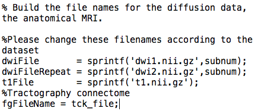
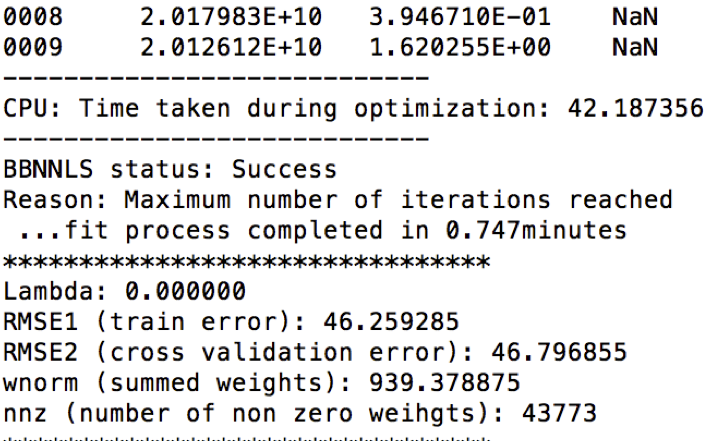
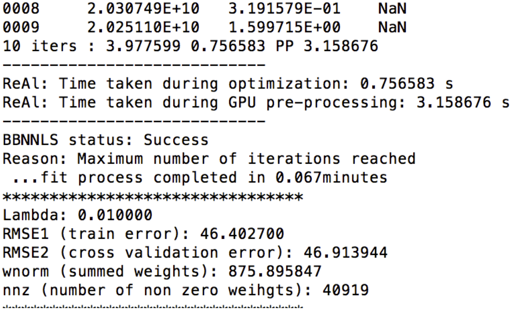

# ReAl-LiFE: Accelerating the discovery of individualized brain connectomes with GPUs

# About
This software implements a Regularized and GPU-accelerated version of LiFE. The original implementation of LiFE is available at https://github.com/brain-life/encode

## License
#### Copyright (2018-), Sawan Kumar, sawan.iitkgp@gmail.com, Varsha Sreenivasan, varshas@iisc.ac.in, Devarajan Sridharan, sridhar@iisc.ac.in
 
## Stable code release
TBA

## Funding
This research was funded by MHRD, Govt. of India (to Sawan Kumar, Varsha Sreenivasan); NSF IIS-1636893, NSF BCS-1734853 (to Franco Pestilli); a Wellcome Trust-Department of Biotechnology India Alliance Intermediate fellowship, a Science and Engineering Research Board Early Career award, a Pratiksha Trust Young Investigator award, a Department of Biotechnology-Indian Institute of Science Partnership Program grant, a Sonata Software foundation grant and a Tata Trusts grant (to Devarajan Sridharan).

## Installation
1. Download the base version of LiFE(https://github.com/brain-life/encode). ReAl-LiFE was built on top of commit 'c979e66' : https://github.com/brain-life/encode/tree/c979e664d897ff72abb62397410b472bfdea8e67 .
2. Refer to https://github.com/brain-life/encode to download and install all the dependencies mentioned there.
3. Download (real-life) into the same folder as #1. The sequence is important, as some files in #1 are updated in this step.
4. Ensure the nvcc compiler is in the PATH environment variable (This instruction is for Ubuntu machines. Update accordingly for other platforms).
5. [Start MatLab](http://www.mathworks.com/help/matlab/startup-and-shutdown.html).
6. Add repository to the [matlab search path](http://www.mathworks.com/help/matlab/ref/addpath.html).

## Dependencies
* [MATLAB](http://www.mathworks.com/products/matlab/).

## Getting Started

Refer to https://github.com/brain-life/encode to get started.

## Running the ReAl LiFE code
(scripts/real/real\_life\_encode.m)
Run 'help real\_life\_encode' for details in the arguments to be used.
Based on which dataset is being used and its location, the paths to diffusion data for training (dwiFile), diffusion data for cross validation (dwiFileRepeat), the anatomical MRI (t1File) and the tractography connectome to be evaluated (tck file) need to be updated.

```
  >>  real_life_encode(use_gpu, tck_file,subnum, Niter, lambda, gpudev)
```
Details on all arguments can be obtained by running "help real\_life\_encode" in MATLAB.

## How to cite the software
Kumar, S., Sreenivasan V., Talukdar P., Pestilli F., and Sridharan D. (2019, January) "ReAl-LiFE: Accelerating the discovery of individualized brain connectomes on GPUs." Accepted to AAAI 2019 (proceedings in press).

# Reproducing the results of the paper

## Dependencies
We capture here the hardware and software dependencies as well as the configurations used to obtain the speedups presented in the paper with ReAl-LiFE. Although these dependencies are not strict, we suggest that settings as described here be used for reproduction and verification.

### Hardware dependencies
All results presented in the paper (CPU and GPU) were obtained using a single machine with specifications as described below. The machine had 8 Intel(R) Xeon(R) CPU E5-2623 v3 @ 3.00GHz processors and 1 NVIDIA GeForce GTX 1080 Ti GPU card. For our experiments we used only 1 CPU and 1 GPU. The machine had a total of 64GB  DDR4 system memory. The DDR4 configuration was 4x16GB 1866 MHz. The GPU cards were configured to have persistence mode enabled. The total hard disk space available was 447 GB, out of which 64 GB was configured as swap.

### Software dependencies
Ubuntu 16.04 was the operating system installed on the machine. MATLAB R2017b 64-bit was used to conduct all experiments. For the GPU experiments, CUDA toolkit 9.0 was installed on the machine. The GPU code binaries were built using the *nvcc* compiler with the flag *-ptx*. 
 
Our code is built on top of the original LiFE code at https://github.com/brain-life/encode. The prerequisites  as mentioned there also apply for our code. Specifically, *Vistasoft* and *Matlab Brain Anatomy* (**MBA**) repositories need to be downloaded.

## Running ReAl-LiFE on GPU
Based on which dataset is being used and its location, the paths to diffusion data for training (dwiFile), diffusion data for cross validation (dwiFileRepeat), the anatomical T1 image (t1File) and the connectome to be evaluated (tck\_file) need to be updated: <br>
 <br>

The baseline results (CPU) for N iterations can be evaluated by running: 
```
  >>  real_life_encode(false, 'x_size1M.tck', x_id, N, 0, 0)
```
where x\_size1M.tck and x\_id are used to identify the location of the input files.

The regularized and GPU-accelerated version with regularization parameter lambda can be evaluated by running:
```
  >>  real_life_encode(true, 'x_size2M.tck', x_id, N, lambda, gpu_device)
```
where gpu\_device is a valid GPU device on the machine.


## Evaluation and expected result.
The performance numbers for CPU can be obtained under "CPU: Time taken during optimization:" in the output of real\_life\_encode: <br><br>
 <br>

The performance number for GPU can be obtained under "ReAl: Time taken during optimization:". The one time GPU overhead can be obtained under "ReAl: Time taken during GPU pre-processing:" in the output: <br><br>
 <br>

The CPU and GPU times thus obtained can be used to reproduce the results in Figure 2. 

For both CPU and GPU, the training error, cross validation error, summed weights and number of non zero weights can be obtained under RMSE1, RMSE2, wnorm and nnz respectively in the output of real\_life\_encode as seen above.

The script  real\_life\_encode  also saves the optimized weights, lengths of fibers in the pruned connectome, and voxel wise RMSE ratios, at weights\_\<lambda\>l\_\<N\>\_X.mat, lengths\_opt\_\<lambda\>l\_\<N\>\_X.mat, and rrmse\_\<lambda\>l\_\<N\>\_X.mat respectively, where lambda is the regularization parameter, N is the number of iterations, and X.tck is the connectome being evaluated. The effect of regularization, as shown in Figure 3, was obtained by varying the regularization parameter, lambda, uniformly in the log-space between 10^(-4) and 1. These data can be used to reproduce Figures 3. 

# Notes on the GPU-based acceleration

Our speedups exceeded state-of-the-art numbers based on a recently reported MPI-acceleration scheme for LiFE [Gugnani et al. 2017]. Our baseline numbers are derived from the same configuration as Gugnani et al's "Cluster A" (single core Intel Xeon E5), enabling us to directly compare our speedup factors with theirs. In that study, the reported maximum multi-node speedups (8.1x) did not exceed the single node speedup value (8.7x), suggesting that MPI may not be an effective parallelization strategy for LiFE. On the other hand, our speedups are an order of magnitude faster (98x), indicating GPU acceleration is an effective strategy.

Further, to ensure that we have not made an unfair comparison to the original algorithm, we have presented the following controls and comparisons in the paper: (a) we provide comparison numbers accounting for all operations and not just the parts offloaded to the GPU, (b) we demonstrate speedups on three independent datasets with a range of configurations, and (c) the comparison was effectively between an efficient C implementation (CPU) and our CUDA implementation. 

Finally, we benchmarked a "toy-example" code, which is a much simplified version of the baseline code. We performed the operation `b(i) = b(i) + a(i)`, on the same CPU where we conducted our experiments. The memory bandwidth achieved with this benchmark was ~2.46 GB/s. Given that the GPU we used (Nvidia GTX 1080i Ti) has a maximum memory bandwidth of 484 GB/s, the maximum possible speedup would be around ~200x for a memory bound process. The speedups we report, with the full algorithm, are of the same order (~50-100x).

## References
[1] Gugnani, S., Lu, X., Pestilli, F., Caiafa, C., & Panda, D. K. (2017, December). MPI-LiFE: Designing High-Performance Linear Fascicle Evaluation of Brain Connectome with MPI. In High Performance Computing (HiPC), 2017 IEEE 24th International Conference on (pp. 213-222). IEEE.
